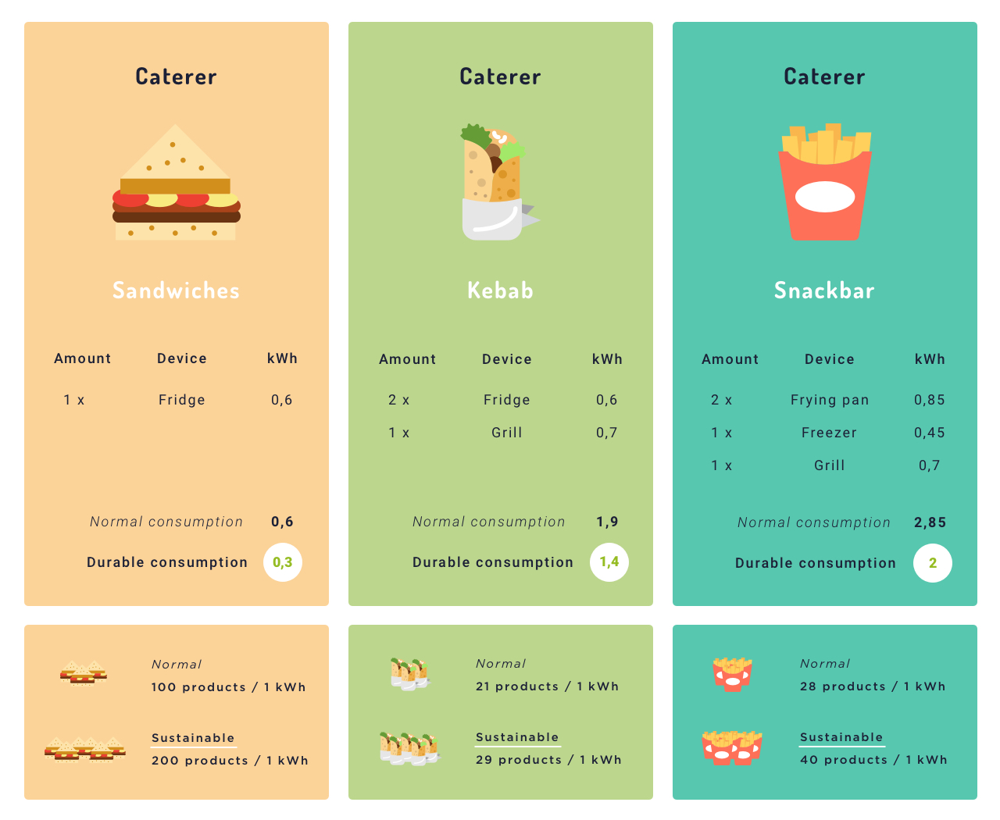
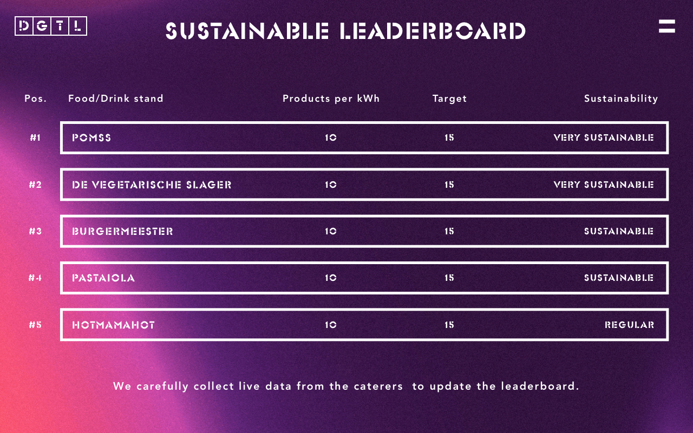

# Project 3 - Catering Sustainability

#### Client:
Watt-Now

#### Date:
May 8 - 12, 2017

#### Team:
Pierre, Frank, Roy & Tijs

## Introduction

This project is based on the knowledge gained from the courses: Real Time Web and Web of Things. The client for this project is Watt-Now, a company that makes off-grid energy more sustainable. They mostly work in the festival industry, so that will be the focus for this project.

## Problem

Every year millions of Diesel is wasted in the event industry. All festivals have food trucks, light shows and big music installations. The waste of energy is bad for the environment but also has economic disadvantages. Watt-Now visualizes detailed power consumption of festivals and created predictive technology that gets smarter with the data input of every festival. This way the festivals get the change to save 40% of the Diesel consumption and build a sustainable future in the event industry.

## Design challenge

The question from Watt-Now is: Given the baseline information of power consumption, what information do you need and how do you translate that into real time events, which are available for the end user, so they can react and reduce there power consumption

## Focus group

The focus group for this project is the festival catering of DGTL festival. In the near future the 9 festival caterers need to pay power consumption per hour. In this way the caterers are forced to be as sustainable as possible. Because doing so, the costs will automatically be reduced. Besides the economic fact, the assumption is made that caterers on a festival with a sustainable trademark, want to show the consumer how sustainable they are themselves.

## Solution

 To create a vibe of competition between the caterers for being the most sustainable, the solution lies in creating a leaderboard. The leaderboard will be physical and online visible. The (realtime) top 5 of the most sustainable caterers will be shown. When a caterer is the most power efficient and by that way most sustainable, the caterer will be ranked higher than others which don't undertake action. The assumption is that festival visitors who go to sustainable festivals, rather choose sustainable caterers instead of caterers who are not.

## Data

On the image above you can see the three use cases. One caterer sells sandwiches, one kebab and the other sells all kind of snackbar items. To calculate the amount of power consumption, the caterers need to create an inventory with all their devices. The sum of the devices's power is seen as "normal consumption". With this data we came up with a "durable consumption" target. If the devices consume that amount of power per hour, they are sustainable.

  To calculate the current consumption level we poll the total of sold products during the day and the realtime power consumption in kWh of the caterer, every 10 seconds. Regarding the power consumption, the average is taken over the last 15 minutes to flatten the peaks. Based on this data we calculate how many products the caterer sells per kWh. This value reflects the efficiency of power consumption and shows the durable level of the caterer.

In the future we want to use real data for this calculation. All the caterers are divided in category types and over time their average power consumption (kWh) per sold product is being measured. With that information we can calculate a real durable consumption target and force the caterers to reduce their consumption.

#### Output

The leaderboard and dashboard will be updated with realtime data. On the leaderboard the caterer's name, the products sold per kWh, the target and the sustainability status is constantly updated.

 On the dashboard is a more detailed linechart visible for the caterer. The data is shown per day. On the chart you can see the sold products, the amount of power consumption and the sustainability. If we could use real data we want to add a price per hour for the power. In the dashboard is also visible how many products are sold and how much power in consumed during the whole day.

## Actions

#### Festival

The festival's data is fully transparent and public to all online and physical audiences. As a result, the festival will get even more respect for their sustainability competition between their caterers.

#### Visitors

The festival visitors who prefer sustainable food, are able to make decisions based on a realtime data gained from the caterers's level of sustainability. Their decision is based on the leaderboard.

#### Caterers

The festival caterers who are forced to pay their power consumption per hour have big economic advantages in being as sustainable as possible. By looking at their status they can undertake actions to be more durable in critical moments. In addition, they can show that they are sustainable, what is good for their reputation.

## Use case

To build a real situation, the following use case has been created. For this case there are 3 different types of caterers: sandwiches, kebab and snackbar.

##### Before the festival

The caterers get asked to create an inventory with all their devices. The sum of all devices results in their predicted power consumption. This is measured in kWh. With that value we could set the normal amount of power consumption. By gathering data for a longer time we could set an average "durable" consumption rate per caterer type.

##### During the festival

 Every 10 seconds a dataset is being pulled from the caterer. The dataset is being processed and new data is send to the leaderboard and the dashboard.

 The leaderboard changes and the visitors can make durable decisions based on the visible data.

 

##### After the festival

The festival and the caterers can show off with their durable status data that is generated during the festival. The caterer can view his personal dashboard with all information about their sustainability.

