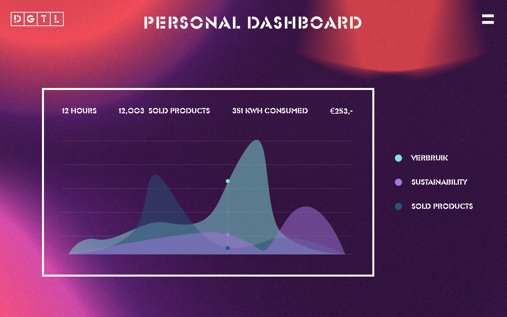

# Project 3 - Catering Sustainability

#### Client:
Watt-Now

#### Date:
May 8 - 12, 2017

#### Team:
Pierre, Frank, Roy & Tijs

## Introduction

This project is based on the knowledge gained from the courses: Real Time Web and Web of Things. The client for this project is Watt-Now, a company that makes off-grid energy more sustainable. They mostly work in the festival industry, so that will be the focus for this project.

## Problem

Every year millions of Diesel is wasted in the event industry. All festivals have food trucks, light shows and big music installations. The waste of energy is bad for the environment but also has economic disadvantages. Watt-Now visualizes detailed power consumption of festivals and created predictive technology that gets smarter with the data input of every festival. This way the festivals get the change to save 40% of the Diesel consumption and build a sustainable future in the event industry.

## Design challenge

The question from Watt-Now is: Given the baseline information of power consumption, what information do you need and how do you translate that into real time events, which are available for the end user, so they can react and reduce there power consumption

## Focus group

The focus group for this project is the festival catering of DGTL festival. In the near future the 9 festival caterers need to pay power consumption per hour. In this way the caterers are forced to be as sustainable as possible. Because doing so, the costs will automatically be reduced. Besides the economic fact, the assumption is made that caterers on a festival with a sustainable trademark, want to show the consumer how sustainable they are themselves.

## Solution

 To create a vibe of competition between the caterers for being the most sustainable, the solution lies in creating a leaderboard. The leaderboard will be physical and online visible. The (realtime) top 10 of the most sustainable caterers will be shown. When a caterer is being most power efficient and by that way most sustainable, the caterer will be ranked higher than others which don't undertake action. The assumption is that festival visitors who go to sustainable festivals, rather choose sustainable caterers instead of caterers who are not.

 For the caterers a light sensor is developed which shows the level of sustainability. The power consumption is measured every 15 minutes and calculated with the quantity of sold products. When the red light is on, it indicates that the caterer is not doing anything in order to be sustainable. When the green light is on, there is a 100% level of sustainability. Because of this the caterer gets reminded to undertake action. Every caterer gets a custom sheet with different solutions.

## Data

#### Input

The caterers information (name, category, power consumption in kWh and products sold per hour) is being generated by hitting a button. The push of the button must represent a transaction being done at the caterers stand. The caterers information is faked with a custom JSON dataset.

#### Calculations

[Here comes the final calculation]

#### Output

The sustainability status data is visible on a physical and online leaderboard. The

On the light strip of the caterer there are 7 lights. The amount of lights that are on and the color depends on the realtime sustainability status. The more red lights, the less durable you are. The more green lights the more durable. When the lights are orange, the consumption is as expected.

## Actions

#### Festival
The festival's data is fully transparent and public to all online and physical audiences. As a result, the festival will get even more respect for their sustainability competition between their caterers.

#### Visitors
The festival visitors who prefer sustainable food, are able to make decisions based on a realtime data gained from the caterers's level of sustainability. Their decision is based on the leaderboard.

#### Caterers
The festival caterers who are forced to pay their power consumption per hour have big economic advantages in being as sustainable as possible. By looking at their status they can undertake actions to be more durable in critical moments. In addition, they can show that they are sustainable, what is good for their reputation.

## Use case

To build a real situation, the following use case has been created. For this case there are 3 different types of caterers: a pizza truck, a pancakes stand and a kebab snackbar.

##### Before the festival
The caterers get asked to create an inventory with all their devices. The sum of all devices results in their predicted power consumption. This is measured in kWh.

##### During the festival
 Every minute a dataset is being pulled from the caterer. The dataset is being processed and new data is send to the leaderboard and the caterers light strip.

 The leaderboard changes and the visitors can make durable decisions based on the visible data. The lightstrip changes and the caterer can take durable actions based on the color and amount of the lights.

##### After the festival

The festival and the caterers can show off with their durable status data that is generated during the festival.

